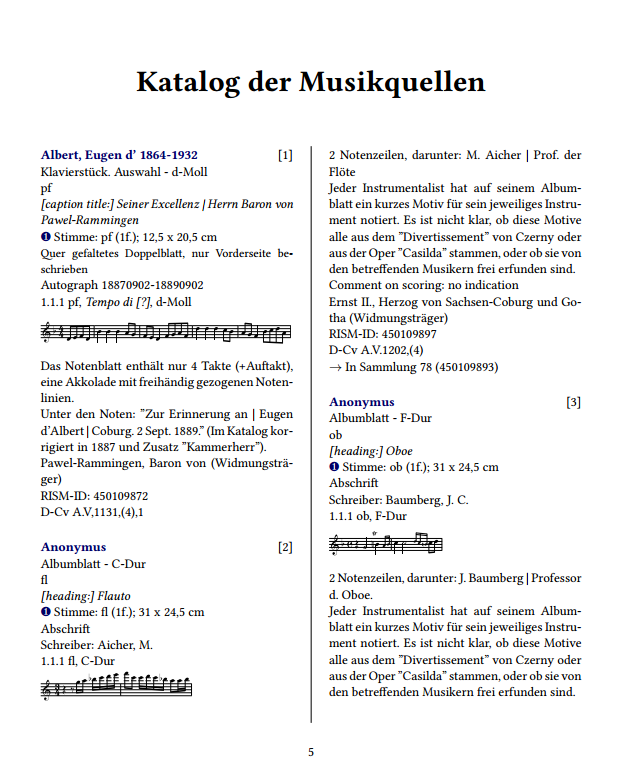

Description
-----------


This software transforms a SRU-query from muscat.rism.info/sru/sources into a PDF-file, provided by LaTex and XSLT 1.0.

Features:
* Integrated SVG of musical incipits generated by verovio.
* Sorting by different categories.
* Included alphabetic index.
* Configurable with XSLT preprocessing.
* Multilanguage support (currently english and german)
* Optional font selection


Requirements
-------------
Working at least with Ubuntu 16.04

Packages and required software

1. Latex, LuaLaTex and all included packages
```bash
sudo apt install tex-common texlive-base texlive-binaries texlive-extra-utils texlive-font-utils texlive-fonts-recommended texlive-generic-recommended texlive-latex-base texlive-latex-extra texlive-latex-recommended texlive-pictures texlive-pstricks texlive-lang-german rubber sed texlive-fonts-extra texlive-lang-greek texlive-xetex
```
2. Inkscape
```bash
sudo apt install inkscape 
```
3. Verovio (called from commandline)
see: https://github.com/rism-ch/verovio/wiki/Building-instructions

4. Ruby
Related packages:
* Nokogiri
* Trollop

6. Sed for some regexp support on the OS

7. Increase the main memory size of texmf.conf:
* Find the correct texmf.conf: 
```bash
kpsewhich -a texmf.cnf
```
* Increase the size:
```latex
main_memory = 7999999
extra_mem_top = 7999999
extra_mem_bot = 7999999
```
* Rebuild the configuration files
```bash
sudo fmtutil-sys --all
```
8. Set ulimit
For using lualatex set new size of opening files:
```bash
ulimit –n 64000
```bash

Basic usage
-----------

Transformation of Marcxml to LaTex is done by calling the ruby script:
```bash
&> ruby pdf.rb --lang="de" --outfile="mozart.pdf" --infile="../mozart.xml" --font="serif"
```
Please consider also generating the input file using the [sru-downloader](https://github.com/rism-international/sru-downloader) in the related repository.
Keep in mind that the ruby script is only a wrapper for calling all the XSLT and can be easily replaced by other program languages.

All temporary files are build in /tmp/.

Language support
-----------------
There are multiple replacements in the MARCXML for inserting optimized values.
They are called by the according folder in the locales directory.
There are two files defining global variables in the preprocessing and in the transform:
* terms.yml: All field values for the replacement, sometimes in singular and plural form.
* variables.xml: Containing variables for the XSLT.

Unicode font
-----------
Default font is Linux Libertine with coverage of Latin, Latin extented, Cyrillic, Greek und Hebrew (ca. 2000 chars). Keep in mind that no actual font covers the complete unicode range. For additional Unicode ranges select your font manually.


Background
-----------
1. Preprocessing
At first the marcxml-file is transformed to a preprocessing xml, which is later used for building the PDF as well as the indices. Every node could have to attributes:
* before: LaTex-code inserted before the node content
* after: appended LaTex-content to the node content

2. XSLT

This process is called from the pdf.rb-script. Main target of the script is the build of a related .TEX-file using the preprocessing file. At the current state the XSLT also defines the order of the resulting document.

3. PDFtex

During the next step the .TEX-file is calling some subroutines:
* Creating textfiles with the Plaine & Easy-code.
* Calling verovio in the subshell to generate the SVG-files.
* Calling \includesvg to insert the graphics into the document.
* Completing the PDF-export.
* Generate the indices.

Hint: The pdftex-command MUST be called from within the output-directory (eg. /tmp/)

Output
------
Result will be look alike example.pdf in this repository.

Indices
-------
Indices can be build also by using the preprocessing and transforming via XSLT. Currently the index of personal names and title/text is incuded in the corpus.

Additional indices could be:
* Watermark
* Shelfmark
* Literature

For implementation see the example code in the index_names*.xls

Localization
--------------

If you like to modify the values of some fields (e.g. to have a special localized version), consider using the help of related software (e.g. Nokogiri with ruby).


